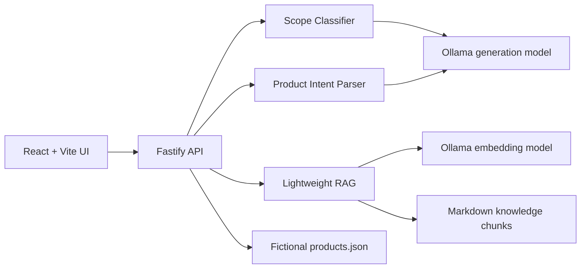
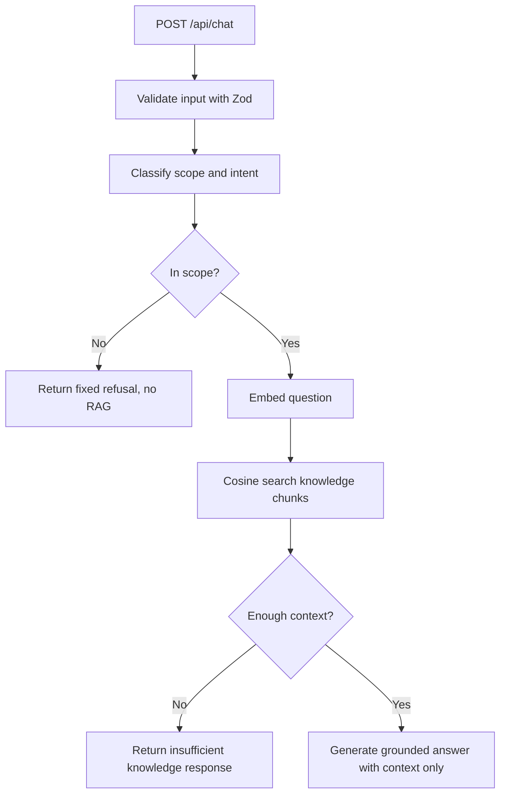
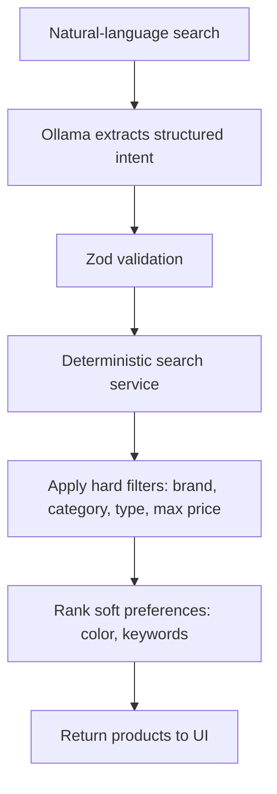

# AI Commerce Assistant

AI Commerce Assistant is a portfolio MVP for a fictional B2B merchandise platform. It demonstrates practical GenAI engineering with local Ollama models, domain guardrails, lightweight RAG, structured LLM output, and deterministic product-search execution.

This is not a production-scale system and does not claim real customers, real usage metrics, or real business data. The catalog and policies are fictional. The project uses guardrails, intent classification, and grounded generation rather than fine-tuning or training.

## What It Does

- Answers commerce-domain questions about products, ordering, delivery, returns, cancellation, shipping, and services.
- Refuses unrelated requests with a deterministic response before retrieval or answer generation.
- Loads Markdown knowledge documents, chunks them, embeds them through Ollama, and performs cosine-similarity retrieval in memory.
- Translates natural-language product searches into validated structured intent.
- Applies hard product filters and soft preference ranking in deterministic TypeScript code.
- Provides a React UI that shows both the AI interpretation and the product results.

## Architecture



The central principle is:

**LLM = probabilistic language understanding**

**Backend = deterministic business execution**

The LLM never directly executes database queries, code, shell commands, arbitrary tools, or product filtering logic.

## AI Assistant Flow



The final answer prompt reinforces that retrieved documents and user input are untrusted data and must not override the assistant's role or system behavior.

## Product Search Flow



Example:

`nike t-shirts under $50, black preferred`

The model may extract:

```json
{
  "requiredFilters": {
    "brand": "Nike",
    "category": "Apparel",
    "subcategory": "T-Shirt",
    "maxPrice": 50
  },
  "preferences": {
    "colors": [{ "value": "black", "weight": 1 }],
    "keywords": []
  }
}
```

The backend then filters Nike T-Shirts under $50 and ranks black products higher. Non-black Nike T-Shirts under $50 are still included because color is a soft preference.

## Ollama Setup

Install Ollama and pull a generation model plus an embedding model:

```bash
ollama pull qwen3:8b
ollama pull nomic-embed-text
```

Create a local `.env` from `.env.example`:

```bash
cp .env.example .env
```

Environment variables:

- `OLLAMA_BASE_URL`: Ollama server URL, usually `http://localhost:11434`
- `OLLAMA_MODEL`: local generation model, example `qwen3:8b`
- `OLLAMA_EMBED_MODEL`: local embedding model, example `nomic-embed-text`
- `PORT`: Fastify API port, default `3001`
- `VITE_API_BASE_URL`: API URL used by the Vite frontend

Changing `OLLAMA_MODEL` should work with another compatible local Ollama chat model. The embedding model is configured separately because retrieval requires embedding vectors.

## Run

```bash
npm install
npm run dev
```

Open the Vite URL printed by the web workspace, usually `http://localhost:5173`.

Useful API endpoints:

- `GET /health`
- `GET /api/ollama/status`
- `POST /api/chat`
- `POST /api/product-search`
- `GET /api/products`
- `POST /api/knowledge/reload`

## Test, Build, Lint

```bash
npm run test
npm run build
npm run lint
npm run format
```

Tests mock the Ollama layer and do not require Ollama to be running.

## Security Notes

- LLM output is treated as untrusted.
- Structured model responses are parsed and validated with Zod.
- No `eval`, `Function` constructor, shell execution, generated-code execution, arbitrary filesystem access, or arbitrary tool execution is used.
- The LLM only extracts intent or generates grounded language from supplied context.
- The backend enforces business filters and ranking.
- Out-of-scope requests bypass RAG and generation.

## Limitations

- The vector store is intentionally lightweight and in memory.
- The knowledge base is small and file-backed.
- There is no authentication, payment workflow, order persistence, admin console, streaming, or production observability.
- Search filters cover a practical demo subset rather than a full commerce taxonomy.

## Future Improvements

- Add persisted vector cache for faster cold starts.
- Add richer product taxonomy and faceted filters.
- Add evaluation cases for grounded answer quality.
- Add admin tooling for knowledge-document updates.
- Add streaming responses once the MVP behavior is stable.
